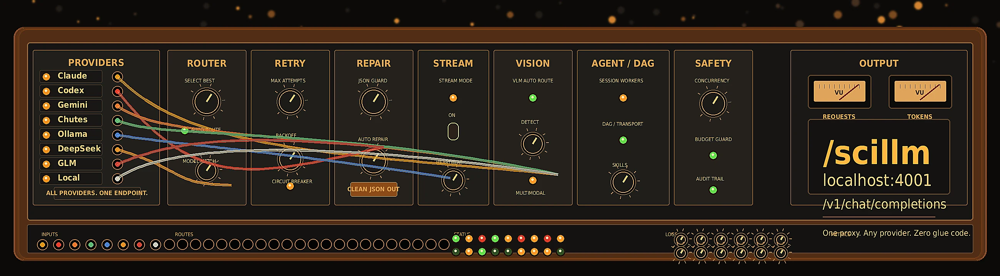
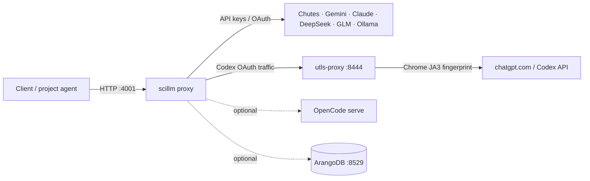

<p align="center">
  
</p>

<h3 align="center">One proxy. Any provider. Zero provider glue in your application.</h3>
<p align="center">Agents and humans call <code>/scillm</code> — it routes, retries, and repairs.</p>

---

scillm is a single-tenant LLM proxy. It unifies **paid subscriptions** (Claude Max, Codex Pro) and **API keys** (Gemini, Chutes, DeepSeek, GLM) behind one OpenAI-compatible endpoint.

Your app keeps one calling shape: `httpx.post("http://localhost:4001/v1/chat/completions", ...)` with a model name like `claude-sonnet-4-6`, `gpt-5.5`, or a configured group such as `text`.

The proxy handles OAuth refresh, format translation, SSE streaming, retries, and failover. Provider-specific glue lives in scillm config, not in your codebase.

## Before you start

| Requirement | Notes |
|-------------|--------|
| **Docker + Compose** | v2 recommended (`docker compose`, not legacy `docker-compose` only) |
| **Host OS** | **Linux** is the primary target. macOS and WSL2 often work but `network_mode: host` behaves differently; expect extra port-mapping tweaks on non-Linux. |
| **Free ports** | **4001** scillm proxy · **8529** ArangoDB · **8601/8602** embedding (text / multimodal) · **8444** utls-proxy (Codex) · OpenCode serve port when `SCILLM_OPENCODE_SERVE_ENABLED=1` (see compose) |
| **`network_mode: host`** | Default compose uses host networking so scillm can reach **local Ollama** and host-mounted OAuth dirs. The proxy is reachable on **localhost** and typically your LAN; treat that as a deployment choice, not “localhost only.” |
| **Disk** | Embedding images download model weights on first use; reserve **several GB** on the Docker data root if you enable the embedding profile. |
| **RAM** | **8 GB+** host RAM for core stack; more if you run embedding + OpenCode serve together. |

## Glossary (first-use)

| Term | Meaning |
|------|---------|
| **QRA** | Question–Reasoning–Answer structured extraction (common in compliance / SPARTA pipelines) |
| **TEE** | Trusted Execution Environment attestation hooks where configured |
| **VLM** | Vision-language model (image + text in one call) |
| **SSE** | Server-Sent Events streaming (`text/event-stream`) |
| **NDJSON** | Newline-delimited JSON (one JSON object per line; used for exec `stream-json`) |
| **DAG** | Directed acyclic graph of exec / harness nodes |
| **Planner** | Human-facing project agent: owns user intent, scope, tradeoffs, communication, and final claims |
| **Orchestrator** | Agentic / Execution Harness: owns DAG or loop state, scheduling, worker coordination, receipts, validation, retries, amendments, and terminal run status |
| **Executor** | Bounded evidence-producing worker: OpenCode subagent, Debugger, Patcher, Reviewer, Researcher, test runner, `scillm exec`, or standing Codex worker |
| **Project agent** | Backend/doc alias for **Planner** — not a built-in scillm daemon |
| **Execution Harness** | Backend/doc alias for **Orchestrator** |
| **OpenCode worker** | Common **Executor** called through OpenCode serve or transport; it inspects, patches, tests, and returns artifacts, but does not own truth or merge authority |
| **Pi** | Optional **exec lane** via the Pi CLI fork for low-overhead Kimi/Chutes runs; **not** required to run the proxy |
| **utls / JA3** | TLS fingerprint proxy sidecar for Codex (`utls-proxy` on **8444**); presents a browser-like JA3 fingerprint to Cloudflare-protected endpoints |

## Quick Start

### Which surface should I use?

| I want to… | Use |
|------------|-----|
| Ask one question / classify / critique / VLM a screenshot | `POST /v1/chat/completions` |
| Run a pipeline gate or one bounded CLI shot | `scillm exec …` or exec graph node |
| Delegate a bounded repo investigation (tools/skills, optional patch) | `POST /v1/scillm/opencode/runs` |
| Stream reasoning, permissions, DAG parent/child, steer | `POST /v1/scillm/opencode/transport/*` |
| Multi-turn Codex authorship in a leased worktree | `/v1/scillm/agents/*` |
| Run delegated work with durable state, receipts, validation, retries, or amendment | **Orchestrator / Execution Harness** |

Full matrix: [Invocation surfaces](#invocation-surfaces) below.

### Planner / Orchestrator / Executor routing

These are human-facing role labels, not implementation class names or schema identifiers. **Planner** means the human-facing Project Agent; it does not mean the internal DAG planner.

Use the Orchestrator when delegated work needs more than one bounded action: DAG or loop state, scheduling, worker coordination, receipt collection, validation gates, retries, amendments, and durable run-terminal status.

```text
Planner (Project Agent)
  -> owns user intent, scope, tradeoffs, communication, final claims

Orchestrator (Execution Harness)
  -> owns delegated execution: DAG/loop state, scheduling, receipts,
     validation, retries, amendment, run-terminal status

Executors (OpenCode workers, Debugger, Patcher, Reviewer, test runner)
  -> own bounded task attempts: inspect, patch, test, return evidence/diff/events
```

Internal Orchestrator run types:

```text
Phase Run
  bounded implementation / validation phase

Campaign Run
  long-running scheduled red/blue/evolve workflow

Role Actor
  red, blue, judge, patcher, validator, researcher
```

Good fit:

```text
Implement Phase 19 with multiple dependent steps, validation gates,
worker receipts, and amendment if a worker fails.

Run an overnight authorized red/blue campaign with scheduled rounds,
attempt ledgers, patch validation, and terminal run status.
```

Not a good fit:

```text
Rename one function.
Run one deterministic test.
Patch one obvious bug.
Ask one model a question.
```

Short rule: if the task needs DAG/loop state, scheduling, worker coordination, receipts, retries, validation, or amendment, delegate the run to the Orchestrator. If it is a single bounded action, the Planner handles it directly or calls one simple Executor surface.


### Option A: Standalone (Recommended for new users)

Self-contained deployment with all services included (ArangoDB, memory service, embedding service).

```bash
# 1. Configure API keys
cp .env.example .env
# Edit .env — set at minimum: CHUTES_API_KEY, CHUTES_API_BASE

# 2. Build and start (first run takes ~5 min to download models)
docker compose -p scillm -f deploy/docker/compose.scillm.standalone.yml up -d --build

# 3. Verify
curl -s http://localhost:4001/health/liveliness
# → {"status": "ok"}

# 4. Call it
curl http://localhost:4001/v1/chat/completions \
  -H "Authorization: Bearer sk-dev-proxy-123" \
  -H "Content-Type: application/json" \
  -d '{"model":"text","messages":[{"role":"user","content": "In one sentence, what is an LLM proxy useful for?"}]}'
```

**Services started:**
- `scillm-proxy` (:4001) — Main LLM gateway
- `scillm-memory` (:8601) — Logging, batch resume, latency stats
- `scillm-embedding` (:8602) — Sentence embeddings
- `scillm-arangodb` (:8529) — Database
- `scillm-utls-proxy` (:8444) — TLS fingerprint for Codex

### Option B: Core Only (For existing infrastructure)

Minimal deployment — assumes memory service (:8601) is already running on host.

```bash
docker compose -p scillm -f deploy/docker/compose.scillm.core.yml up -d --build
```

### Upgrade

```bash
cd /path/to/scillm
git pull
docker compose -p scillm -f deploy/docker/compose.scillm.core.yml build scillm-proxy utls-proxy
docker compose -p scillm -f deploy/docker/compose.scillm.core.yml up -d
```

Re-run `bash scripts/sanity_all_endpoints.sh` (or your project’s sanity script) after provider credential changes.

### Uninstall / cleanup

```bash
docker compose -p scillm -f deploy/docker/compose.scillm.core.yml down -v   # removes compose volumes
# Optional: remove local OAuth mounts, Arango data dir, and .scillm artifact dirs you created
```

## Invocation surfaces

### OpenCode Go vs OpenCode serve (do not confuse)

| Name | What it is | How you invoke it |
|------|------------|-------------------|
| **OpenCode Go** | Chat completions through the proxy | Model prefix `opencode-go/…` on `POST /v1/chat/completions` (one-shot HTTP) |
| **OpenCode serve** | Multi-step **agent session** with tools/skills | `POST /v1/scillm/opencode/runs` with an **agent profile** (`build`, `scillm-debugger`, …) — **not** a chat model id |

OpenCode serve is **not** “serve mode” of OpenCode Go; it is a separate sidecar + API surface.

### Spectrum: one-shot → standing worker

```text
one-shot chat ──► bounded exec node ──► bounded OpenCode session ──► standing Codex agent
     │                    │                      │                           │
 POST /v1/chat      scillm exec /           POST …/opencode/runs        /v1/scillm/agents/*
 completions         exec graph              (+ transport for SSE)

Planner ──► Orchestrator ──► Executors
             Phase Run       Debugger / Patcher / Reviewer / test runner
             Campaign Run    OpenCode worker / standing Codex worker / exec node
```

scillm is not only a chat proxy. Pick the surface by **job**, not by “strongest model”:

| Surface | Endpoint | Use when | Project-agent collaboration |
|---------|----------|----------|----------------------------|
| **Chat** | `POST /v1/chat/completions` | One-shot reasoning, critique, classification, VLM | None — text/JSON back |
| **Exec** | `scillm exec …` or `POST /v1/scillm/exec` | Deterministic pipelines; LLM at gates; bounded headless CLI | Single artifact per node; not an interactive coding loop |
| **OpenCode serve** | `POST /v1/scillm/opencode/runs` | Bounded **coding/patch delegate**: read/grep/tools/skills in one session | **Yes** — project agent launches, validates diff/text, merges or forks retry |
| **OpenCode transport** | `POST /v1/scillm/opencode/transport/*` | Same family as serve, plus DAG parent/child, **SSE** reasoning/permissions, steer | **Yes** — course correction on long investigations |
| **Standing agents** | `/v1/scillm/agents/*` | Multi-turn **Codex** authorship in a leased worktree | **Yes** — handoff → lease → turn → result; memory stays in `/memory` |
| **Orchestrated run** | Execution Harness / local harness APIs | Delegated work needing DAG/loop state, receipts, validation, retries, amendments, terminal run status | **Yes** — Planner audits Orchestrator receipts before human-facing claims |

### Orchestrator vs direct OpenCode

The Orchestrator, also called the Execution Harness in backend docs and schemas, is the delegated execution controller. It is not the human-facing Planner. It may run Phase Runs or Campaign Runs, coordinate Role Actors, and dispatch OpenCode serve/transport workers for bounded DAG nodes, but Executors return evidence, not human-facing truth. Orchestrator terminal status must be based on receipts and validation gates, and human-facing claims still need Planner audit.

Call OpenCode directly when there is one bounded coding attempt and the Planner can validate the result immediately. Call the Orchestrator when the Planner is delegating work that needs durable state, a DAG/loop, scheduling, receipts, retries, or amendment.

### pdf-lab repair lane

`$pdf-lab` second-pass repair is the canonical high-trust example for the
Planner / Orchestrator / Executor split:

| Role | Concrete pdf-lab responsibility |
|------|---------------------------------|
| **Planner** | Selects the page case, sets repair scope, communicates with the human, and audits evidence before any final claim |
| **Orchestrator** | Runs the execution harness/transport DAG, preserves `batch_id`/`case_id`/`page_number`/`transport_run_id`, tracks delivery, validates receipts, and owns terminal run status |
| **Executor** | OpenCode Debugger/Patcher identifies the code defect, edits only the isolated code root, adds or updates focused tests, and returns text/diff/events as evidence |

Use these scillm surfaces together:

| Need | Surface | Notes |
|------|---------|-------|
| Provider/proxy sanity | `POST /v1/chat/completions` | Always send `X-Caller-Skill: pdf-lab`; missing caller must fail with `caller_skill_required` |
| Single bounded patch delegate | `POST /v1/scillm/opencode/runs` | `agent` is an OpenCode profile such as `build`, not an `opencode-go/*` chat model |
| DAG, Debugger, collaboration, steer | `POST /v1/scillm/opencode/transport/*` | Parent/child transport run; monitor SSE/events or persisted state |

For live gates, prepare a mounted isolated code root under the project workspace
so the proxy and OpenCode serve runtime see the same filesystem. Avoid arbitrary
`/tmp` code roots for acceptance evidence. OpenCode can patch the isolated root;
the deterministic pdf-lab harness still owns scope validation, tests,
before/after extraction evidence, commit gate, and rollback evidence.

Minimum evidence before claiming this lane is healthy:

- `GET /health/liveliness`
- `GET /v1/scillm/opencode/health`
- chat preflight with `X-Caller-Skill: pdf-lab`
- missing-caller negative test returning `caller_skill_required`
- OpenCode serve canary with receipt validation, patch scope validation, patch delta, and passing tests
- transport parent/child/message canary with `delivery_state=completed`, non-empty `assistant_text`, `diff=[]` for read-only canaries, and clean isolated worktree status

### Why OpenCode serve (between chat and exec)

**Chat** returns one completion — no repo tool loop. **`scillm exec`** runs a **single** bounded headless worker (`codex exec`, Pi, one-shot `opencode run` with skills/shell denied in generated config) — good for pipeline **gates**, not for “investigate this repo and propose a patch.”

**OpenCode serve** is the **tier‑1.5 coding delegate**: a bounded OpenCode session with an **agent profile** (`build`, `scillm-debugger`, …), native tools, and an optional Agent Skills allowlist. The **Planner** still owns the goal, `/memory` recall, deterministic validation, and **merge authority**. The serve Executor returns **evidence** (`assistant_text`, `events.jsonl`, optional `diff` under `.scillm/opencode-serve/`); Orchestrator validators and the Planner decide pass/fail — OpenCode output is not auto-merged.

Use **standing `/v1/scillm/agents/*`** when you need a **long-lived Codex** worker across many turns in an isolated worktree. Use **transport** when the harness or `/agent-debugger` needs **streaming** supervision and fork/steer (see [OpenCode transport v1](docs/SCILLM_OPENCODE_TRANSPORT_V1.md)).

**Enable and verify:**

```bash
# compose: SCILLM_OPENCODE_SERVE_ENABLED=1 (see deploy/docker/compose.scillm.core.yml)
docker compose -p scillm -f deploy/docker/compose.scillm.core.yml up -d --build opencode-serve scillm-proxy
bash scripts/sanity_opencode_serve.sh
```

**Minimal serve run** (agent profile — not `opencode-go/kimi-k2.6`):

```bash
curl -s -X POST http://localhost:4001/v1/scillm/opencode/runs \
  -H "Authorization: Bearer sk-dev-proxy-123" \
  -H "X-Caller-Skill: my-project" \
  -H "Content-Type: application/json" \
  -d '{"prompt":"Inspect tests/test_foo.py and explain the failure. Do not edit.","agent":"build","skills":["memory","scillm"],"timeout_s":600}'
```

Full contract: [`docs/SCILLM_OPENCODE_SERVE.md`](docs/SCILLM_OPENCODE_SERVE.md). Agent/skill reference: [`skills/scillm/SKILL.md`](skills/scillm/SKILL.md).

## Why Docker, Not `pip install`


**Hybrid library model:** The supported default is **HTTP** to `localhost:4001`. Optional Python helpers (e.g. `scillm.batch`, `scillm.paved`) exist for batch iteration and grounding; you do not need to import them to use the proxy.

scillm runs as a **persistent proxy service**, not a library you import. This is deliberate:

- **One process, many callers.** Every project agent, skill, and script on the machine hits the same `localhost:4001` endpoint. A pip package would mean each caller imports scillm, manages its own connections, and duplicates retry/circuit-breaker state. The proxy centralizes all of that.
- **OAuth token sharing.** Claude and Codex OAuth credentials live in `~/.claude/` and `~/.codex/`. The Docker container mounts these read-only — one token refresh serves every caller. A library would need each process to handle token management independently.
- **Provider isolation.** If Chutes goes down, the circuit breaker opens *once* in the proxy and all callers immediately cascade to DeepSeek. With a library, each process discovers the failure independently and wastes retries.
- **Config changes without restarts.** Update `proxy_server_config.yaml`, rebuild the container, done. Every caller sees the new model list immediately. No code changes, no redeployments, no version bumps.
- **No dependency conflicts.** The proxy's dependencies (httpx, openai SDK, json_repair) live inside the container. Callers only need `httpx` — they don't inherit scillm's dependency tree.

The `src/scillm/batch.py` and `src/scillm/paved/chat.py` modules are also importable as a library for advanced use cases (parallel batch iteration, source grounding) that need tighter integration than HTTP. But the standard path is `httpx.post("http://localhost:4001/v1/chat/completions")`.

## Why scillm

scillm started because cheap LLM providers (Chutes, DeepSeek) are unreliable — 503s, timeouts, rate limits with 90-second penalties. Fixed retry counts don't work when a provider might be back in 20 seconds or down for 5 minutes. scillm was built to make flaky providers reliable: wall-time retry budgets, circuit breakers, fallback cascades. The multi-provider unification came later as a natural extension.

If you already have Claude Max and Codex Pro subscriptions plus a few API keys, scillm turns them into one endpoint with zero provider glue in your application. Here's what you'd need without it:

| Capability | Without scillm | With scillm |
|------------|---------------|-------------|
| **Call Claude** | Anthropic SDK, manage OAuth tokens, translate message format, handle `system` prompt constraints | `model: "claude-sonnet-4-6"` — done |
| **Call Codex** | Custom SSE parser for chatgpt.com backend, `chatgpt-account-id` header, strip unsupported params | `model: "gpt-5.5"` — done |
| **Tool use** | Different tool format per provider (Anthropic input_schema, Codex flattened, Gemini native) | Send OpenAI-format `tools` — proxy translates |
| **Call Gemini with files** | Gemini REST API, `inlineData` parts, ZIP explosion logic, MIME detection | Attach files in messages — auto-routed |
| **Call any Ollama model** | Configure each model, manage base URL | Pull and call — auto-detected |
| **Streaming** | Different SSE format per provider, custom parsers for each | `"stream": true` — same format for all |
| **Failover** | Client-side retry logic per provider, circuit breaker state per process | Proxy handles cascade + circuit breaker |
| **Concurrency** | Per-process semaphores, risk of 429 penalties | Proxy queues globally — one semaphore |
| **JSON repair** | Retry the whole call on broken JSON | Proxy repairs and returns — no wasted call |
| **Metadata round-trip** | Track request-response correlation manually | `scillm_metadata` — stripped before LLM, returned unchanged |
| **Provider switch** | Change code in every caller | Change YAML config — callers unchanged |
| **OAuth refresh** | Each process manages token lifecycle | Proxy mounts credentials — one refresh |

**Compared to multi-provider proxies** (LiteLLM, Portkey, Helicone, OpenRouter):

| | scillm | Multi-provider proxies |
|---|---|---|
| **Subscription bridging** | Uses your Claude Max + Codex Pro subscriptions directly (OAuth) | API keys only — can't use Max/Pro subscriptions |
| **Tool use translation** | OpenAI tools → Anthropic/Codex/Gemini native format, streaming tool deltas | Pass-through only (tools must match provider format) |
| **Tenant model** | Single-user, runs locally, data stays on your machine | Multi-tenant SaaS or complex self-host |
| **File handling** | ZIP explosion, Gemini `inlineData`, Claude PDF blocks, VLM auto-routing | Pass-through only (OpenRouter has a PDF plugin) |
| **JSON repair** | Multi-stage repair loop (`json_repair` + brace trim + prose rejection) | OpenRouter has response-healing; others reject |
| **Provider count** | ~8 built-in + any OpenAI-compatible via YAML | 100–1,600 integrations |
| **Observability** | Prometheus metrics + budget headers | Full tracing dashboards, cost forecasting |
| **Performance overhead** | ~20ms (Python) — irrelevant when LLM calls take 2–30s | 0.01–8ms (Go/Rust) — matters at 5K+ RPS, not single-user |
| **Cost** | Free (your subscriptions + API keys) | Free tier + paid for volume |
| **Customization** | Full source, add middleware in Python | Configuration only |

**What scillm is not:** A general-purpose proxy platform. It has 8 providers, not 1,600. No SSO, no RBAC, no dashboards. It's a single-user tool for engineers who already pay for Claude Max and Codex Pro and want one `httpx.post()` call that works with everything — including the parts (OAuth bridging, JSON repair, file handling, VLM routing) that no multi-provider proxy offers.

## What You Get

Every provider scillm targets speaks OpenAI-compatible `/v1/chat/completions`. Adding a provider is usually a **small YAML block** in `proxy_server_config.yaml`. The proxy handles format translation, OAuth refresh, SSE normalization, and fallback cascading.

### Routing and resilience

- **Wall-time retry budget** — Providers with hot/cold cycling return 503 now but may be back in 20 seconds. Fixed retry counts fail here. scillm retries on a clock — keep trying for 90 seconds, not 3 attempts.
- **JSON repair inside retry loop** — LLM responses with trailing commas, missing braces, or markdown fences wrapping JSON are repaired automatically instead of wasting the call.
- **Auto multimodal routing** — Pass an image and scillm figures it out. No model selection needed — the proxy detects images in messages and reroutes to a vision model automatically.
- **VLM routing** — Images can go directly to `gpt-5.5` through Codex OAuth or through the legacy `vlm` cascade. For Chutes VLM, select an exact live `Org/Model` at runtime with `ops-chutes` and call `/v1/scillm/chutes/*`; do not use a Chutes selector alias.
- **Gemini free-to-paid key rotation** — Gemini free and paid keys are separate groups. A 429 on the free key cascades immediately to the paid key — no wasted retries on an exhausted quota.
- **Cold-start warmup** — Chutes models that return 503 (cold) trigger a background warmup API call that posts a bounty for miners. The proxy falls through to the next deployment immediately. On startup, configured Chutes models are pre-warmed.
- **Bounded concurrency queue** — Chutes.ai has a 5-connection limit. Exceed it and you get a 429 with a 90-second penalty. scillm queues overflow instead of rejecting it. Queue timeout is 600s (10 min) — large batches drain rather than fail.
- **Batch-friendly error semantics** — Queue exhaustion returns 503 (service unavailable), not 429 (rate limit). 429s come only from upstream providers. Abuse guard is disabled for authenticated callers — no cascade failures from transient errors.
- **Automatic timeout estimation (chat/batch)** — For `/v1/chat/completions` and batch routes, scillm queries historical latency data (p95 from `llm_call_log`) and sets per-call provider budgets. For long streaming chat calls, use a short connect timeout, SSE heartbeat/idle liveness, and an explicit overall budget. Does **not** replace `cursor_exec` stream-json supervision — see [Exec monitoring](#exec-monitoring-and-timeouts-chat--cursor).
- **Exact Chutes model calls** — Chutes text and VLM calls use exact live `Org/Model` IDs selected at runtime with `ops-chutes`. Scillm does not expose Chutes chat selector aliases because Chutes inventory changes frequently.
- **Fallback cascade with circuit breaker** — General configured groups still use same-provider fallback policy where configured. For quota-sensitive image work, prefer `gpt-5.5` for Codex OAuth or an exact Chutes VLM model through `/v1/scillm/chutes/*`. The legacy `vlm` alias still starts with Gemini. 3 failures trigger a 20-second cooldown per group.
- **Non-TEE fast-fail routing** — Multi-model Chutes groups try non-TEE first (better throughput) with 1 retry, then fall through to TEE. No 8-retry stall on cold non-TEE models.
- **5xx-specific backoff** — Server errors (503) get different retry timing than rate limits (429).
- **Ollama auto-routing** — Any locally-pulled Ollama model works without a config entry. The proxy auto-detects unknown model names and routes them to the local Ollama instance.
- **SSE streaming for all providers** — `"stream": true` works everywhere, including Claude and Codex OAuth. The proxy translates provider-specific SSE formats into OpenAI-compatible delta chunks, emits heartbeat comments while providers are silent, and enforces the caller’s overall `timeout` as the stream budget.

### Format translation and providers

- **Tool use across all providers** — Send OpenAI-format `tools` and `tool_choice`. The proxy translates to each provider's native format: Anthropic tool blocks for Claude, flattened Responses API for Codex, native function calling for Gemini. Streaming tool call deltas work everywhere.
- **Native system prompts** — Claude gets an array of system blocks (matches Claude Code CLI). Codex gets the `instructions` field. No fake user-message hacks.
- **Claude PDF support** — Send PDFs via `data:application/pdf;base64,...` in `image_url` or as Anthropic-native `type:document` blocks. Both formats auto-translate.
- **Gemini native file support** — Send PDFs, images, and ZIP archives via `inlineData` parts when targeting Gemini. ZIP files are auto-exploded into individual parts (text as text, binaries as native `inlineData`).

### Batch and streaming

- **Batch iterator with request-response pairing** — Fire 200 parallel requests, results arrive out of order. scillm's `as_completed` iterator pairs every response with its original request.
- **Opaque metadata round-trip** — Send `scillm_metadata` (any dict) in the request. The proxy strips it before the LLM sees it, then staples it back onto the response. The LLM cannot fabricate these values — use it for ArangoDB `_key` correlation in batch pipelines.

### Files and multimodal

- **Source grounding verification** — Pass source text, scillm verifies the response is grounded using fuzzy matching, retries with progressive prompts if not.


### Observability and ops

- **Prometheus metrics** — Request counts, latency, and provider health at `GET /metrics` (when enabled).
- **Status and auth probes** — `GET /health/liveliness`, `GET /v1/status`, `GET /v1/scillm/auth` for quick sanity checks.
- **Call logging** — Optional `llm_call_log` in ArangoDB for latency history and batch correlation.
- **Budget headers** — Spend caps via `budgets:` in config; see [Budget and spend caps](#budget-and-spend-caps).

## Provider Setup

Most providers need zero code — just credentials on disk or in `.env`.

| Provider | What to do | Model names |
|----------|-----------|-------------|
| **Claude** | Nothing (if using Claude Code — token is already in `~/.claude/.credentials.json`) | `claude-sonnet-4-6`, `claude-haiku-4-5` |
| **Codex** | One-time on host: `npm install -g @openai/codex && codex login` (creates `~/.codex/auth.json`; mount into container) | `gpt-5.5` |
| **Gemini** | Add `GEMINI_API_KEY=...` to `.env` ([get key](https://aistudio.google.com/apikey)) | `gemini-2.5-flash`, `gemini-3-flash-preview` |
| **GLM** | Add `GLM_API_Key=...` to `.env` ([z.ai](https://z.ai)) | `text-glm` (glm-5.1) |
| **Chutes** | Add `CHUTES_API_KEY` + `CHUTES_API_BASE` to `.env` | `text` (default), or any `Org/Model` from Chutes catalog |
| **DeepSeek** | Add `DEEPSEEK_API=...` to `.env` | `text-deepseek` |
| **OpenCode Go** | Add `OPENCODE_GO_API_KEY=...` to `.env` | `opencode-go/kimi-k2.6`, `opencode-go/deepseek-v4-pro`, `opencode-go/minimax-m2.7` |
| **OpenCode serve** | `SCILLM_OPENCODE_SERVE_ENABLED=1` in compose; `OPENCODE_SERVER_PASSWORD` when starting serve (mirror in `.env`) | Agent profiles via `POST /v1/scillm/opencode/runs` — **not** chat model names |
| **Ollama** | `ollama pull model:tag` (local, no auth) | Any `model:tag` |

After adding credentials, rebuild: `docker compose -p scillm -f deploy/docker/compose.scillm.core.yml up -d --build`

**Check what's working:** `curl http://localhost:4001/v1/scillm/auth -H "Authorization: Bearer sk-dev-proxy-123"`

**List OpenCode Go models:** `curl http://localhost:4001/v1/scillm/opencode-go/models -H "Authorization: Bearer sk-dev-proxy-123"` refreshes via the Docker-installed `opencode models --refresh opencode-go` CLI by default, then falls back to `opencode serve` and a built-in registry. The Docker compose mounts the host OpenCode auth/config/cache so the container sees the same connected `opencode-go` provider as your host CLI.

Makefile shortcuts: `make proxy-rebuild` (build+start), `make proxy-up`, `make proxy-down`, `make proxy-logs`

**Container details:** Single Python process (uvicorn, :4001). Separate `utls-proxy` sidecar (:8444) for Codex TLS fingerprinting. `network_mode: host` (for local Ollama access), config mounted from `local/proxy_server_config.yaml`, health check every 15s. Ollama available via `--profile local`.

## Exec Workers

**Cursor** profiles assume the **Cursor CLI/agent is installed locally** on the host; scillm shells out to it; there is no cloud Cursor API in the provider table.

### Advanced: Pi exec lanes (optional)

Pi lanes (`pi-chutes-kimi`, `pi-opencode-kimi`, …) require `PI_BIN` pointing at your Pi CLI and optional `PI_WORKSPACE`. They are **optional** low-overhead exec runners, not part of the default Docker image.

`scillm exec` is the bounded worker layer for agentic tasks. It is separate from
ordinary one-shot `/v1/chat/completions` calls:

| Command/profile | Runner | Backing model | Notes |
|-----------------|--------|---------------|-------|
| `scillm exec pi-chutes-kimi` | `pi_exec` | Pi CLI over Chutes `moonshotai/Kimi-K2.6-TEE` | Preferred low-overhead Chutes Kimi exec lane. Uses the local Pi fork (`$PI_BIN` on the host, forwarded into the container) and runs with `--thinking off`. Override binary/model with `SCILLM_PI_BINARY` and `SCILLM_PI_CHUTES_KIMI_MODEL`. |
| `scillm exec pi-opencode-kimi` | `pi_exec` | Pi CLI over OpenCode Go `kimi-k2.5` | Preferred Pi route when Chutes Kimi produces empty/no-write exec output. Uses Pi's native `opencode-go` provider support and `OPENCODE_API_KEY`; override with `SCILLM_PI_OPENCODE_KIMI_MODEL`. |
| `scillm exec oc-chutes-deepseek` | `opencode_exec` | OpenCode CLI over Chutes `chutes/moonshotai/Kimi-K2.6-TEE` by default | OpenCode worker lane. Override with `SCILLM_OPENCODE_CHUTES_DEEPSEEK_MODEL`. |
| `scillm exec codex-gpt-5.5` | `codex_exec` | Codex CLI `gpt-5.5` | Bounded `codex exec --json` worker. Not the same as chat `model: "gpt-5.5"`. API accepts deprecated alias `gpt-5.5` on `codex_exec`. Override with `SCILLM_CODEX_EXEC_MODEL`, `--codex-model`, `--reasoning-effort`. |
| `scillm exec codex-vision` | `codex_exec` | Codex CLI `gpt-5.3-codex` (default) | Vision/heavy Codex exec lane. Override with `SCILLM_CODEX_EXEC_MODEL_VISION`. |
| `scillm exec cursor-auto` | `cursor_exec` | Cursor CLI `auto` | Bounded writes with `--cursor-force` and `--allow-write`. |
| `scillm exec cursor-plan` | `cursor_exec` | Cursor CLI plan mode | Read-only diagnose (`--mode plan`, no `--force`). |
| `scillm exec cursor-composer-2.5` | `cursor_exec` | Cursor CLI composer model | Profile-only; do not pass through chat completions. |
| `oc-*` and `opencode-go/*` | HTTP chat/batch routes | OpenCode Go API | These are one-shot Scillm model routes, not exec workers. |


### Exec monitoring and timeouts (chat ≠ cursor)
**Chat / batch:** SSE heartbeats and caller timeouts (see features below).

**`cursor_exec`:** streams **NDJSON** progress; tail `GET /v1/scillm/exec/{run_id}/events` or `.scillm/cursor-headless/.../cursor-events.jsonl`. Full stream contract: [`docs/SCILLM_EXEC.md`](docs/SCILLM_EXEC.md).

## Troubleshooting

| Symptom | Likely cause | What to do |
|---------|--------------|------------|
| **401 Unauthorized** | Wrong/missing bearer | Match `Authorization: Bearer …` to `SCILLM_MASTER_KEY` in `.env`; probe `GET /v1/scillm/auth` |
| **503** on Chutes / cold model | Provider warming or cascade exhausted | Retry; check `GET /v1/status`; verify Chutes API key and model slug |
| **429 / rate limit** | Provider or local concurrency guard | Back off; reduce batch width; check ops quota skills |
| **OAuth / auth errors** (Claude, Codex) | Stale token in mounted dir | Re-login on host (`claude login`, `codex login`), restart proxy so mounts refresh |
| **Empty JSON / truncated reasoning** | `max_tokens` too low on reasoning models | Omit `max_tokens` or raise it; see provider notes in skill reference |
| **OpenCode serve unreachable** | Sidecar disabled or password mismatch | `SCILLM_OPENCODE_SERVE_ENABLED=1`; align `OPENCODE_SERVER_PASSWORD`; `bash scripts/sanity_opencode_serve.sh` |

**Logs**

```bash
docker compose -p scillm -f deploy/docker/compose.scillm.core.yml logs -f scillm-proxy
docker compose -p scillm -f deploy/docker/compose.scillm.core.yml logs -f utls-proxy
```

Structured call history (when Arango logging is enabled): `llm_call_log` collection — see [`docs/SCILLM_EXEC.md`](docs/SCILLM_EXEC.md) and project skill reference.

## Security

### If you expose scillm beyond localhost

Default compose is aimed at **trusted dev machines**. If you must expose the API:

1. Put **TLS** in front (reverse proxy: Caddy, nginx, Traefik).
2. **Rotate** `SCILLM_MASTER_KEY`; never ship the dev default.
3. **Firewall** so only known clients reach port 4001 (and do not publish Arango/embedding ports).
4. Prefer **bridge networking + explicit port maps** over `network_mode: host` on shared servers.
5. Review OAuth mount paths and file permissions on the host.

scillm is designed for **local development and trusted networks**. The default configuration uses:

- A static bearer token (`sk-dev-proxy-123`) — set `SCILLM_MASTER_KEY` in `.env` to override.
- `network_mode: host` — required for local Ollama access. In production, switch to port mapping (`-p 4001:4001`) behind a reverse proxy with TLS.
- API keys in `.env` — acceptable for dev. In production, use Docker Secrets, Vault, or your cloud's secrets manager.

scillm does not implement multi-tenant auth, key rotation, or per-client access control. It's designed for single-user research and engineering workflows.

For local blast-radius control, scillm can enforce optional `caller_profiles`
keyed by `X-Caller-Skill`. These are not users, teams, or virtual keys; they
are local safety rules for known callers. Profiles can restrict model
aliases/pools, deny dangerous model patterns, require `scillm_metadata` keys
such as `batch_id` and `item_id`, block tools/files/images/PDFs/streaming, and
cap provider timeout. See `registry/caller_profiles.example.yaml` for a minimal
copyable profile set.

## How to Call It

### `/scillm` skill

Agents and humans invoke `/scillm` the same way — no API calls, no key management, no provider selection:

```
/scillm "Explain quantum computing in one sentence"
/scillm "Analyze results/chart.png and explain the trends"
/scillm --model moonshot-text "Explain quantum computing in one sentence"
```

Reference file paths inline and scillm handles the rest — reads the file, base64-encodes it, picks a vision model, routes the request. Works across any IDE or agent that supports slash commands. Use `--model` only when you need to force a specific proxy alias such as `moonshot-text` or `text-kimi`.

### OpenAI SDK

The proxy speaks standard OpenAI. Any existing code or SDK works — just point it at `localhost:4001`:

```python
from openai import OpenAI
client = OpenAI(base_url="http://localhost:4001/v1", api_key="sk-dev-proxy-123")
r = client.chat.completions.create(model="text", messages=[{"role": "user", "content": "In one sentence, what is an LLM proxy useful for?"}])
```

Both paths hit the same Docker proxy at `localhost:4001`.

## Parallel Batch Completions

For high-throughput QRA/default DeepSeek work, prefer the server-side model pool endpoint. It lets scillm split work across independent Chutes and OpenCode Go lanes, enforce provider-specific concurrency centrally, and return results as each item completes.

**Discover pools:**

```bash
curl http://localhost:4001/v1/scillm/model-pools \
  -H "Authorization: Bearer sk-dev-proxy-123"
```

**Dashboard/live status:**

```bash
curl http://localhost:4001/v1/scillm/model-pools/qra-deepseek-pool/status \
  -H "Authorization: Bearer sk-dev-proxy-123"
```

The status response is the dashboard contract for pool concurrency. It returns
top-level `live_in_flight`, `actual_in_flight`, `limit`, `queued`, `available`,
and per-lane state with `live_in_flight`, `semaphore_in_flight`,
`stale_active_calls`, and `registry_drift`. Dashboard progress should use
`live_in_flight`; stale registry rows are diagnostics only. Timeout errors
include structured details such as `caller`, `batch_id`, `item_id`, `provider`,
`model`, `elapsed_ms`, `timeout_s`, `cascade_attempts`, and
`final_provider_error`.

**Submit a batch:**

```python
import httpx

resp = httpx.post(
    "http://localhost:4001/v1/scillm/batch/completions",
    headers={
        "Authorization": "Bearer sk-dev-proxy-123",
        "Content-Type": "application/json",
        "X-Caller-Skill": "create-qras",
    },
    json={
        "model_pool": "qra-deepseek-pool",
        "items": [
            {
                "item_id": "qra-001",
                "messages": [{"role": "user", "content": "Return one valid QRA JSON object."}],
                "scillm_metadata": {"batch_id": "batch-20260425", "item_id": "qra-001"},
            }
        ],
    },
    timeout=900.0,
)

for result in resp.json()["results"]:
    item_id = result["item_id"]  # join by item_id; results are completion-ordered
    served_by = result["model_served"]
```

Built-in pool:

| Pool | Strategy | Lanes |
|------|----------|-------|
| `qra-deepseek-pool` | Weighted round-robin | Chutes `deepseek-ai/DeepSeek-V3-0324-TEE` + OpenCode Go `opencode-go/deepseek-v4-flash` |

Use client-side batching only when you need a custom model set or local post-processing between calls. In that case, use `asyncio.create_task` + `asyncio.as_completed` so slow provider calls do not block completed results.

`parallel_acompletions_iter` — an async iterator that yields results as they complete, with every result carrying its original request.

```python
from scillm.batch import parallel_acompletions_iter

requests = [
    {"messages": [{"role": "user", "content": f"Summarize document {doc_id}"}],
     "metadata": {"doc_id": doc_id}}  # your data rides along
    for doc_id in document_ids
]

async for result in parallel_acompletions_iter(requests, concurrency=6):
    doc_id = result["request"]["metadata"]["doc_id"]  # paired back to your request
    if result["ok"]:
        save(doc_id, result["response"])
    else:
        retry_queue.append(doc_id)
```

Each yielded `result`:

| Field | What it is |
|-------|-----------|
| `index` | Position in original list (for ordering) |
| `request` | Your original request dict, including any metadata you attached |
| `ok` | Success boolean |
| `response` / `error` | The OpenAI response or error message |
| `attempts` | Retry count |
| `elapsed_s` | Wall-clock time |

## Tool Use (Function Calling)

Send OpenAI-format `tools` and `tool_choice` — the proxy translates to each provider's native format automatically:

```python
resp = httpx.post(
    "http://localhost:4001/v1/chat/completions",
    headers={"Authorization": "Bearer sk-dev-proxy-123"},
    json={
        "model": "claude-sonnet-4-6",  # or gpt-5.5, text-gemini, text
        "messages": [{"role": "user", "content": "What's the weather in SF?"}],
        "tools": [{
            "type": "function",
            "function": {
                "name": "get_weather",
                "description": "Get weather for a location",
                "parameters": {"type": "object", "properties": {"location": {"type": "string"}}}
            }
        }],
        "tool_choice": "auto",
    },
    timeout=60.0,
)
# response.choices[0].message.tool_calls → standard OpenAI tool_calls format
```

**What the proxy handles per provider:**
- **Claude**: Translates `parameters` → `input_schema`, maps `tool_choice` (auto/required/none/specific), converts tool_use blocks back to OpenAI format
- **Codex**: Flattens to Responses API format (name at top level), forces `tool_choice: "auto"` (Codex doesn't support `"required"`), adds `parallel_tool_calls: true` and reasoning fields
- **Gemini**: Native function calling — passed through

Streaming tool calls work on all providers (`"stream": true`). Tool call deltas arrive as standard OpenAI delta chunks with `tool_calls[].function.arguments` fragments.

## Opaque Metadata Round-Trip

Send `scillm_metadata` (any dict) in the request body. The proxy strips it before the LLM sees it, staples it back onto the response unchanged. The LLM cannot fabricate or hallucinate these values.

```python
resp = httpx.post(url, json={
    "model": "text",
    "messages": [{"role": "user", "content": "Assess this control..."}],
    "scillm_metadata": {"_key": "sparta_controls/12345", "stage": "S12"},
}, headers=headers)

data = resp.json()
data["scillm_metadata"]["_key"]  # → "sparta_controls/12345" — guaranteed untouched
```

Works with all providers. Use it for ArangoDB `_key` correlation in async batch pipelines where results arrive out of order.

## Source Grounding Verification

Pass a `source` field and scillm verifies the response is grounded using fuzzy token matching. If the response doesn't meet the threshold, scillm retries with progressive prompts that push the model to stick to the source.

Use cases: compliance summaries against regulatory text, legal citation checks against statutes or case law, research summaries against source papers.

```python
requests = [
    {
        "messages": [{"role": "user", "content": "Summarize AC-17 requirements"}],
        "source": "findings/ac17_control.txt",  # file path or inline text
        "grounding_threshold": 0.7,              # default 0.7
        "grounding_retries": 2,                  # default 2
    }
]

results = await parallel_acompletions(requests, source="global_source.txt")
# result["grounding_score"] → 0.85
# result["grounding_attempts"] → 1
```

| Field | Type | Default | Description |
|-------|------|---------|-------------|
| `source` | `str \| list[str]` | None | File path(s) or inline text. Per-request overrides batch-level. |
| `grounding_threshold` | `float` | 0.7 | Minimum fuzzy match score (0.0–1.0) to accept. |
| `grounding_retries` | `int` | 2 | Max retry attempts with progressive grounding prompts. |

Progressive retry strategy:
1. **Try 1:** Normal completion
2. **Try 2:** Appends "Base your answer strictly on the provided source text."
3. **Try 3:** Appends "Base your answer strictly on the provided source text. Quote directly from the source."

Results carry `grounding_score` (float) and `grounding_attempts` (int). Uses `rapidfuzz.fuzz.token_set_ratio` (~1ms per check).

## Architecture



**Request flow:**
```
Client → scillm :4001 (Python) → Provider API
                ↓
       utls-proxy :8444 (Codex only)
                ↓
       chatgpt.com (Chrome TLS fingerprint)
```

**Components:**
- **scillm** (Python, port 4001): Public API, request validation, JSON guard, VLM auto-routing, OAuth token injection, SSE streaming normalization, retries, circuit breakers, fallback cascades. Routes directly to providers via openai SDK.
- **utls-proxy** (Go, port 8444): TLS fingerprint proxy for Cloudflare-protected endpoints. Uses [utls](https://github.com/refraction-networking/utls) to present Chrome's TLS fingerprint, bypassing Cloudflare's JA3 blocking on `chatgpt.com`.

**Config:** `local/proxy_server_config.yaml` — single source of truth for models, providers, and fallback chains.


**Model naming:** `gpt-5.5` is the **chat** Codex OAuth model for `POST /v1/chat/completions`. `gpt-5.3-codex` is the default backing model for **`scillm exec codex-vision`** (bounded CLI worker). They are different surfaces, not duplicate aliases.

## Model Groups

> **VLM routing:** Prefer **`gpt-5.5`** when Gemini quota is tight. For Chutes VLM, use an exact live `Org/Model` through `/v1/scillm/chutes/*`. The **`vlm`** group is a legacy cascade that may try Gemini first.

Callers choose stable non-Chutes groups such as `gpt-5.5`, `gemini-flash`, or `claude-sonnet-4-6`. For Chutes, callers pass exact live `Org/Model` IDs selected at runtime.

| Group | Provider | Model | Fallback chain |
|-------|----------|-------|----------------|
| `text-gemini` | Google | Gemini 2.5 Flash (free key) | → text-gemini-paid → text-deepseek |
| `text-gemini-paid` | Google | Gemini 2.5 Flash (paid key) | (none) |
| `text-gemini-3` | Google | Gemini 3 Flash Preview (free) | → text-gemini-3-paid |
| `vlm` | Google | Gemini 2.5 Flash (free key) | Legacy cascade; avoid for quota-sensitive VLM work |
| `vlm-claude` | Anthropic (OAuth) | Claude Sonnet | Images + PDFs |
| `vlm-codex` | OpenAI (OAuth) | `gpt-5.3-codex` | Images + PDFs (chat/VLM group; exec vision: `scillm exec codex-vision`) |
| `gpt-5.5` | OpenAI (OAuth) | Codex high-reasoning model via `~/.codex` | Direct text + image calls |
| `opencode-go/deepseek-v4-flash` | OpenCode Go | DeepSeek V4 Flash through OpenCode Go/Fireworks | (none) |
| `opencode-go/deepseek-v4-pro` | OpenCode Go | DeepSeek V4 Pro through OpenCode Go/Fireworks | (none) |
| `local-text` | Ollama | qwen2.5:0.5b | (none) |
| `moonshot-text` | Moonshot | Kimi K2 | (none) |
| `text-glm` | Z.AI GLM | glm-5.1 | (none) |
| Any `claude-*` | Anthropic | Auto-routed via Claude Code OAuth | (none) |
| Any `gpt-*`/`codex-*` | OpenAI | Auto-routed via Codex CLI OAuth | (none) |
| Any `gemini-*` | Google | Auto-routed to Gemini API | (none) |
| Any `Org/Model` | Chutes | Auto-routed to Chutes API | (none) |
| Any `model:tag` | Ollama | Auto-routed to local Ollama | (none) |

Auto-routing handles most model names without config entries. Claude and Codex use OAuth from `~/.claude/` and `~/.codex/` respectively. Gemini free/paid are separate groups — 429 on free cascades immediately to paid.

## Adding Your Own Models

### Minimal `proxy_server_config.yaml` (annotated)

Mounted at `local/proxy_server_config.yaml` in the default compose stack:

```yaml
# Top-level model group: clients pass the group id as "model"
model_groups:
  text:                          # group id → POST model: "text"
    description: "Default text cascade"
    models:                      # ordered list: primary + fallbacks
      - deepseek/deepseek-chat
      - gemini/gemini-2.5-flash

  my-custom:                     # add a group in a small YAML block
    description: "Team-specific route"
    models:
      - chutes/Qwen/Qwen3-235B-A22B-Instruct-2507

budgets:
  default:
    daily_usd: 25.0
```

Point `model` at a **group id** (e.g. `text`, `my-custom`), not always a raw provider string.

### Budget and spend caps

- **`GET /v1/budget`** returns per-caller usage vs configured caps (when budgeting is enabled in config).
- Configure limits under `budgets:` in `local/proxy_server_config.yaml` (see example above) and/or environment overrides documented in `.env.example`.
- When a cap is exceeded, the proxy returns a **budget-exceeded** error rather than silently routing to a cheaper model.


Most providers are auto-routed by model name — see the Provider Setup table above. No config entry needed for Claude, Codex, Gemini, Chutes `Org/Model`, or Ollama `model:tag`.

For providers that need a custom API base or key, add an entry to `local/proxy_server_config.yaml`:

```yaml
# Example: add Together.ai
- model_name: together-llama
  scillm_params:
    model: meta-llama/Llama-4-Scout-17B-16E-Instruct
    api_base: https://api.together.xyz/v1
    api_key: os.environ/TOGETHER_API_KEY
    timeout: 45
```

Then add `TOGETHER_API_KEY=...` to `.env` and rebuild:

```bash
make proxy-rebuild  # or: docker compose -p scillm -f deploy/docker/compose.scillm.core.yml up -d --build
```

Now `{"model": "together-llama", "messages": [...]}` works. Callers don't know or care which provider serves it.

**Add to fallback cascade** (optional): if Together goes down, fall back to Chutes:

```yaml
scillm_settings:
  fallbacks:
    - together-llama: [text]  # fall back to the "text" group (Chutes DeepSeek-V3)
```

**Constraint:** The provider must speak OpenAI's `/v1/chat/completions` format. Most do (Together, Groq, Fireworks, Perplexity, Mistral, etc.).

## Testing

```bash
make smokes-cli-fast    # Quality gate: proxy-only smokes
make smokes             # Full suite including Ollama preflight
make test-e2e           # 24 pytest e2e tests against live proxy
make test-adversarial   # 44 adversarial tests (auth, streaming, grounding, edge cases)
```

Test files: `tests/test_proxy_e2e.py` (contract tests), `tests/test_proxy_adversarial.py` (edge cases), `tests/test_grounding.py` (unit tests for grounding helpers).

## The `/scillm` Skill

`/scillm` is also available as a slash command (skill) in AI coding agents. Any agent skill that needs an LLM completion calls `/scillm` — one endpoint, any provider.

**Auto-routing by model name** — no config entries needed for most providers:

| Pattern | Provider | Auth |
|---------|----------|------|
| `claude-*` | Anthropic | Claude Code Max OAuth |
| `gpt-*` / `codex-*` | OpenAI Codex | ChatGPT OAuth |
| `gemini-*` | Google Gemini | API key |
| `Org/Model` | Chutes | API key |
| `model:tag` | Ollama (local) | none |

**Discover available models:** `GET /v1/scillm/providers`

**Discover capability facts:** `GET /v1/scillm/capabilities`

**Composes with:** `/task-monitor`, `/create-evidence-case`, `/analytics`, `/create-figure`, `/llm-eval-lab`

**Agent reference:** [`skills/scillm/SKILL.md`](skills/scillm/SKILL.md) — workflow map and surface picker. **Deep detail:** [`skills/scillm/references/`](skills/scillm/references/) (batch, OAuth, serve, transport, agents).

## Ops Endpoints

| Endpoint | What it tells you |
|----------|------------------|
| `GET /health/liveliness` | Is the proxy alive? |
| `GET /v1/scillm/health` | Model groups, fallback chains, retry policy, concurrency slots |
| `GET /v1/scillm/models` | Deployed models with group membership |
| `GET /v1/scillm/capabilities` | Read-only model, adapter, pool, and caller policy capability facts |
| `GET /v1/scillm/model-pools` | Server-side batch pools and lane definitions |
| `GET /v1/scillm/model-pools/{pool}/status` | Live aggregate and per-lane pool concurrency for dashboards |
| `GET /v1/scillm/opencode-go/models?refresh=true` | Live OpenCode Go model discovery |
| `GET /v1/scillm/active-calls` | Raw active-call rows for debugging; not the dashboard pool source of truth |
| `POST /v1/scillm/active-calls/purge` | Purge stale in-memory active-call rows |
| `POST /v1/scillm/batch/completions` | Server-side batch completions using `model_pool` |
| `GET /v1/scillm/opencode/health` | OpenCode serve connectivity |
| `GET /v1/scillm/opencode/agents` | OpenCode agent profiles on serve |
| `POST /v1/scillm/opencode/runs` | Bounded OpenCode coding/patch run (main serve entry) |
| `POST /v1/scillm/opencode/serve/debugger/run` | Serve run with default debugger agent |
| `GET /v1/scillm/opencode/events` | Live OpenCode SSE bus (`curl -N`) |
| `GET /v1/scillm/agents/registry` | Standing Codex workers (check `workers` length) |
| `POST /v1/scillm/agents/{worker_id}/turn` | Deliver handoff to standing worker |
| `GET /v1/models` | OpenAI-compatible model list |
| `GET /v1/budget` | Current daily spend and remaining budget |
| `GET /v1/scillm/logs` | Cost summary by model for a given date |
| `GET /metrics` | Prometheus counters (requests, errors, latency by group) |

## Logging

All LLM calls are logged to ArangoDB (`llm_call_log` collection) via the memory service. **No Redis for logging** — Redis is only for optional caching.

**JSONL backup** — every call is also appended to `/mnt/storage12tb/scillm-logs/` (or `$SCILLM_LOG_BACKUP_DIR`). This backup is independent of ArangoDB, append-only, and survives database wipes. Files are organized by month (`YYYY-MM/calls-YYYY-MM-DD.jsonl`). The Docker compose mounts this path.

Each log entry includes:
- `ts`, `date` — timestamp and date partition
- `model_requested`, `model_served` — what caller asked for vs what served
- `provider` — inferred provider (chutes, gemini, anthropic, etc.)
- `duration_ms`, `prompt_tokens`, `completion_tokens`, `cost_usd` — performance and cost
- `request_prompt` — last user message (truncated to 4000 chars)
- `response_content` — raw LLM response for debugging
- `status`, `error` — ok/error with error type if failed

Query logs via memory service:
```bash
curl -X POST http://localhost:8601/query -H "Content-Type: application/json" -d '{
  "aql": "FOR doc IN llm_call_log FILTER doc.date == \"2026-04-13\" SORT doc.ts DESC LIMIT 10 RETURN doc"
}'
```

**Silent batch failures are forbidden.** If a batch reports "0 stored" without explanation, check `llm_call_log` for raw `response_content` — it will reveal schema mismatches (e.g., LLM returns `abstain_reason` but code checks `reason`).

## License

MIT License.

## FAQ

**What does `GET /v1/status` look like?**

```bash
curl -s http://localhost:4001/v1/status -H "Authorization: Bearer sk-dev-proxy-123" | python3 -m json.tool | head -40
```

Use this for a quick health snapshot before digging into `docker compose logs`.

**Can I use LangChain / OpenAI SDK / LiteLLM client?**  
Yes. Point the client at `http://localhost:4001/v1` and use your scillm bearer token. scillm speaks OpenAI-compatible chat completions.

**Does scillm serve embeddings?**  
The compose stack can run embedding services on **8601/8602** for memory/RAG pipelines. Chat/completions routing is separate; see embedding compose profile and `.env.example`.

**Can I run without Docker?**  
Possible for development (`uvicorn` + local config) but **Docker is the supported path** (OAuth mounts, utls-proxy sidecar, OpenCode serve). The README and sanity scripts assume compose.

**Is `vlm` the right model alias?**  
Prefer **`gpt-5.5`** when Gemini quota matters. For Chutes VLM, use an exact live `Org/Model` through `/v1/scillm/chutes/*`. **`vlm`** is a **legacy cascade** that may try Gemini first.

## Documentation

| Doc | Audience | Contents |
|-----|----------|----------|
| [Invocation surfaces](#invocation-surfaces) (this README) | Humans onboarding | When to use chat vs exec vs OpenCode serve vs transport vs standing agents |
| [`skills/scillm/SKILL.md`](skills/scillm/SKILL.md) | Project agents / slash `/scillm` | Workflow map, surface picker, minimal examples |
| [`skills/scillm/references/`](skills/scillm/references/) | Agents (on demand) | Batch, OAuth, files, serve, transport, standing agents |
| [`docs/SCILLM_OPENCODE_SERVE.md`](docs/SCILLM_OPENCODE_SERVE.md) | OpenCode serve operators | `POST /v1/scillm/opencode/runs`, env, Docker sidecar, fork, skills allowlist, artifacts |
| [`docs/SCILLM_OPENCODE_TRANSPORT_V1.md`](docs/SCILLM_OPENCODE_TRANSPORT_V1.md) | Harness / agent-debugger | DAG parent/child, **SSE** reasoning/permissions, transport `events.jsonl` |
| [`docs/SCILLM_OPENCODE_INTEGRATION.md`](docs/SCILLM_OPENCODE_INTEGRATION.md) | Integrators | Fail-closed control plane; do not call raw serve ports from product code |
| [`docs/interactive-agents/README.md`](docs/interactive-agents/README.md) | Standing Codex workers | `/v1/scillm/agents/*` handoff → lease → turn; see [routing](docs/interactive-agents/routing.md) |
| [`docs/SCILLM_EXEC.md`](docs/SCILLM_EXEC.md) | Exec graphs | `scillm exec`, cursor stream-json, exec artifacts |
