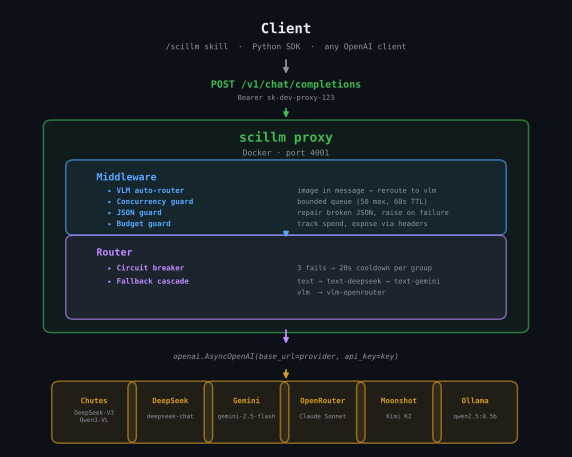

<p align="center">
  <picture>
    <source media="(prefers-color-scheme: dark)" srcset="docs/assets/logo/SciLLM_balanced.dark.svg" />
    
  </picture>
</p>

<h3 align="center">One proxy. Any provider. Zero glue code.</h3>
<p align="center">Agents and humans call <code>/scillm</code> — it routes, retries, and repairs.</p>

---

Single-tenant LLM proxy that unifies your **paid subscriptions** (Claude Max, Codex Pro) and **API keys** (Gemini, Chutes, DeepSeek, GLM) behind one OpenAI-compatible endpoint. No provider-specific code — just `httpx.post("http://localhost:4001/v1/chat/completions", json={"model": "claude-sonnet-4-6", ...})` and scillm handles OAuth token refresh, format translation, SSE streaming, retries, and failover automatically. Works with any model name: `claude-*`, `gpt-*`, `gemini-*`, `Org/Model`, or `model:tag`.

## Quick Start

```bash
# 1. Configure API keys
cp .env.example .env
# Edit .env — set at minimum: CHUTES_API_KEY, CHUTES_API_BASE

# 2. Build and start
docker compose -p scillm -f deploy/docker/compose.scillm.core.yml up -d --build

# 3. Verify
curl -s http://localhost:4001/health/liveliness
# → {"status": "ok"}

# 4. Call it
curl http://localhost:4001/v1/chat/completions \
  -H "Authorization: Bearer sk-dev-proxy-123" \
  -H "Content-Type: application/json" \
  -d '{"model":"text","messages":[{"role":"user","content":"hi"}],"max_tokens":16}'
```

## Provider Setup

Most providers need zero code — just credentials on disk or in `.env`.

| Provider | What to do | Model names |
|----------|-----------|-------------|
| **Claude** | Nothing (if using Claude Code — token is already in `~/.claude/.credentials.json`) | `claude-sonnet-4-6`, `claude-haiku-4-5` |
| **Codex** | One-time: `npm install -g @openai/codex && codex login` | `gpt-5.3-codex` |
| **Gemini** | Add `GEMINI_API_KEY=...` to `.env` ([get key](https://aistudio.google.com/apikey)) | `gemini-2.5-flash`, `gemini-3-flash-preview` |
| **GLM** | Add `GLM_API_Key=...` to `.env` ([z.ai](https://z.ai)) | `text-glm` (glm-5.1) |
| **Chutes** | Add `CHUTES_API_KEY` + `CHUTES_API_BASE` to `.env` | `text` (default), or any `Org/Model` from Chutes catalog |
| **DeepSeek** | Add `DEEPSEEK_API=...` to `.env` | `text-deepseek` |
| **Ollama** | `ollama pull model:tag` (local, no auth) | Any `model:tag` |

After adding credentials, rebuild: `docker compose -p scillm -f deploy/docker/compose.scillm.core.yml up -d --build`

**Check what's working:** `curl http://localhost:4001/v1/scillm/auth -H "Authorization: Bearer sk-dev-proxy-123"`

Makefile shortcuts: `make proxy-rebuild` (build+start), `make proxy-up`, `make proxy-down`, `make proxy-logs`

**Container details:** Multi-process via `supervisord`: scillm (Python/uvicorn, :4001) + Bifrost (Go, :4002). Separate `utls-proxy` sidecar (:8444) for Codex TLS. `network_mode: host` (for local Ollama access), config mounted from `local/proxy_server_config.yaml`, health check every 15s. Ollama available via `--profile local`. Set `BIFROST_ENABLED=true` in `.env` to send EVERY call through Bifrost and view logs/costs at `http://127.0.0.1:4002/workspace/logs`.

## Security

scillm is designed for **local development and trusted networks**. The default configuration uses:

- A static bearer token (`sk-dev-proxy-123`) — set `SCILLM_MASTER_KEY` in `.env` to override.
- `network_mode: host` — required for local Ollama access. In production, switch to port mapping (`-p 4001:4001`) behind a reverse proxy with TLS.
- API keys in `.env` — acceptable for dev. In production, use Docker Secrets, Vault, or your cloud's secrets manager.

scillm does not implement multi-tenant auth, key rotation, or per-client access control. It's designed for single-user research and engineering workflows.

## What You Get

Every provider scillm targets speaks OpenAI-compatible API (`/v1/chat/completions`). Provider-specific handler code is unnecessary for this use case. Adding a provider is 5 lines of YAML. The proxy handles format translation (OpenAI tools → Anthropic/Codex/Gemini native), OAuth token management, streaming SSE normalization, and fallback cascading — not a framework, just the code that does the work.

- **Tool use across all providers** — Send OpenAI-format `tools` and `tool_choice`. The proxy translates to each provider's native format: Anthropic tool blocks for Claude, flattened Responses API for Codex, native function calling for Gemini. Streaming tool call deltas work everywhere.
- **Wall-time retry budget** — Providers with hot/cold cycling return 503 now but may be back in 20 seconds. Fixed retry counts fail here. scillm retries on a clock — keep trying for 90 seconds, not 3 attempts.
- **Batch iterator with request-response pairing** — Fire 200 parallel requests, results arrive out of order. scillm's `as_completed` iterator pairs every response with its original request.
- **Opaque metadata round-trip** — Send `scillm_metadata` (any dict) in the request. The proxy strips it before the LLM sees it, then staples it back onto the response. The LLM cannot fabricate these values — use it for ArangoDB `_key` correlation in batch pipelines.
- **JSON repair inside retry loop** — LLM responses with trailing commas, missing braces, or markdown fences wrapping JSON are repaired automatically instead of wasting the call.
- **Auto multimodal routing** — Pass an image and scillm figures it out. No model selection needed — the proxy detects images in messages and reroutes to a vision model automatically.
- **4-provider VLM cascade** — Images and PDFs cascade through Gemini free → Gemini paid → Claude OAuth → Codex OAuth. All four providers handle images; Claude and Codex also handle PDFs natively.
- **Gemini free-to-paid key rotation** — Gemini free and paid keys are separate groups. A 429 on the free key cascades immediately to the paid key — no wasted retries on an exhausted quota.
- **Cold-start warmup** — Chutes models that return 503 (cold) trigger a background warmup API call that posts a bounty for miners. The proxy falls through to the next deployment immediately. On startup, configured Chutes models are pre-warmed.
- **Bounded concurrency queue** — Chutes.ai has a 5-connection limit. Exceed it and you get a 429 with a 90-second penalty. scillm queues overflow instead of rejecting it.
- **Automatic timeout estimation** — No more guessing timeouts. scillm queries historical latency data (p95 from `llm_call_log`) and sets per-call provider timeouts automatically. Response headers (`x-scillm-timeout-ms`, `x-scillm-timeout-source`) show what was used.
- **Source grounding verification** — Pass source text, scillm verifies the response is grounded using fuzzy matching, retries with progressive prompts if not.
- **Fallback cascade with circuit breaker** — `text` → `text-gemini` (free) → `text-gemini-paid` → `text-deepseek`. VLM: `vlm` (free) → `vlm-paid` → `vlm-claude` → `vlm-codex`. 3 failures trigger a 20-second cooldown per group.
- **Non-TEE fast-fail routing** — Multi-model Chutes groups try non-TEE first (better throughput) with 1 retry, then fall through to TEE. No 8-retry stall on cold non-TEE models.
- **Native system prompts** — Claude gets an array of system blocks (matches Claude Code CLI). Codex gets the `instructions` field. No fake user-message hacks.
- **Claude PDF support** — Send PDFs via `data:application/pdf;base64,...` in `image_url` or as Anthropic-native `type:document` blocks. Both formats auto-translate.
- **5xx-specific backoff** — Server errors (503) get different retry timing than rate limits (429).
- **Gemini native file support** — Send PDFs, images, and ZIP archives via `inlineData` parts when targeting Gemini. ZIP files are auto-exploded into individual parts (text as text, binaries as native `inlineData`).
- **Ollama auto-routing** — Any locally-pulled Ollama model works without a config entry. The proxy auto-detects unknown model names and routes them to the local Ollama instance.
- **SSE streaming for all providers** — `"stream": true` works everywhere, including Claude and Codex OAuth. The proxy translates provider-specific SSE formats into OpenAI-compatible delta chunks, including streaming tool call deltas.

## Why Docker, Not `pip install`

scillm runs as a **persistent proxy service**, not a library you import. This is deliberate:

- **Go gateway for performance.** The Bifrost routing layer is written in Go (via [Bifrost](https://github.com/maximhorse314/bifrost)), handling concurrent requests with native performance. The Python layer handles API translation and middleware. Both run in one container via supervisord.
- **One process, many callers.** Every project agent, skill, and script on the machine hits the same `localhost:4001` endpoint. A pip package would mean each caller imports scillm, manages its own connections, and duplicates retry/circuit-breaker state. The proxy centralizes all of that.
- **OAuth token sharing.** Claude and Codex OAuth credentials live in `~/.claude/` and `~/.codex/`. The Docker container mounts these read-only — one token refresh serves every caller. A library would need each process to handle token management independently.
- **Provider isolation.** If Chutes goes down, the circuit breaker opens *once* in the proxy and all callers immediately cascade to DeepSeek. With a library, each process discovers the failure independently and wastes retries.
- **Config changes without restarts.** Update `proxy_server_config.yaml`, rebuild the container, done. Every caller sees the new model list immediately. No code changes, no redeployments, no version bumps.
- **No dependency conflicts.** The proxy's dependencies (httpx, openai SDK, json_repair) live inside the container. Callers only need `httpx` — they don't inherit scillm's dependency tree.

The `src/scillm/batch.py` and `src/scillm/paved/chat.py` modules are also importable as a library for advanced use cases (parallel batch iteration, source grounding) that need tighter integration than HTTP. But the standard path is `httpx.post("http://localhost:4001/v1/chat/completions")`.

## Why scillm

scillm started because cheap LLM providers (Chutes, DeepSeek) are unreliable — 503s, timeouts, rate limits with 90-second penalties. Fixed retry counts don't work when a provider might be back in 20 seconds or down for 5 minutes. scillm was built to make flaky providers reliable: wall-time retry budgets, circuit breakers, fallback cascades. The multi-provider unification came later as a natural extension.

If you already have Claude Max and Codex Pro subscriptions plus a few API keys, scillm turns them into one endpoint with zero glue code. Here's what you'd need without it:

| Capability | Without scillm | With scillm |
|------------|---------------|-------------|
| **Call Claude** | Anthropic SDK, manage OAuth tokens, translate message format, handle `system` prompt constraints | `model: "claude-sonnet-4-6"` — done |
| **Call Codex** | Custom SSE parser for chatgpt.com backend, `chatgpt-account-id` header, strip unsupported params | `model: "gpt-5.3-codex"` — done |
| **Tool use** | Different tool format per provider (Anthropic input_schema, Codex flattened, Gemini native) | Send OpenAI-format `tools` — proxy translates |
| **Call Gemini with files** | Gemini REST API, `inlineData` parts, ZIP explosion logic, MIME detection | Attach files in messages — auto-routed |
| **Call any Ollama model** | Configure each model, manage base URL | Pull and call — auto-detected |
| **Streaming** | Different SSE format per provider, custom parsers for each | `"stream": true` — same format for all |
| **Failover** | Client-side retry logic per provider, circuit breaker state per process | Proxy handles cascade + circuit breaker |
| **Concurrency** | Per-process semaphores, risk of 429 penalties | Proxy queues globally — one semaphore |
| **JSON repair** | Retry the whole call on broken JSON | Proxy repairs and returns — no wasted call |
| **Metadata round-trip** | Track request-response correlation manually | `scillm_metadata` — stripped before LLM, returned unchanged |
| **Provider switch** | Change code in every caller | Change YAML config — callers unchanged |
| **OAuth refresh** | Each process manages token lifecycle | Proxy mounts credentials — one refresh |

**Compared to multi-provider proxies** (LiteLLM, Portkey, Helicone, OpenRouter):

| | scillm | Multi-provider proxies |
|---|---|---|
| **Subscription bridging** | Uses your Claude Max + Codex Pro subscriptions directly (OAuth) | API keys only — can't use Max/Pro subscriptions |
| **Tool use translation** | OpenAI tools → Anthropic/Codex/Gemini native format, streaming tool deltas | Pass-through only (tools must match provider format) |
| **Tenant model** | Single-user, runs locally, data stays on your machine | Multi-tenant SaaS or complex self-host |
| **File handling** | ZIP explosion, Gemini `inlineData`, Claude PDF blocks, VLM auto-routing | Pass-through only (OpenRouter has a PDF plugin) |
| **JSON repair** | Multi-stage repair loop (`json_repair` + brace trim + prose rejection) | OpenRouter has response-healing; others reject |
| **Provider count** | ~8 built-in + any OpenAI-compatible via YAML | 100–1,600 integrations |
| **Observability** | Prometheus metrics + budget headers | Full tracing dashboards, cost forecasting |
| **Performance overhead** | ~20ms (Python) — irrelevant when LLM calls take 2–30s | 0.01–8ms (Go/Rust) — matters at 5K+ RPS, not single-user |
| **Cost** | Free (your subscriptions + API keys) | Free tier + paid for volume |
| **Customization** | Full source, add middleware in Python | Configuration only |

**What scillm is not:** A general-purpose proxy platform. It has 8 providers, not 1,600. No SSO, no RBAC, no dashboards. It's a single-user tool for engineers who already pay for Claude Max and Codex Pro and want one `httpx.post()` call that works with everything — including the parts (OAuth bridging, JSON repair, file handling, VLM routing) that no multi-provider proxy offers.

## How to Call It

### `/scillm` skill

Agents and humans invoke `/scillm` the same way — no API calls, no key management, no provider selection:

```
/scillm "Explain quantum computing in one sentence"
/scillm "Analyze results/chart.png and explain the trends"
```

Reference file paths inline and scillm handles the rest — reads the file, base64-encodes it, picks a vision model, routes the request. Works across any IDE or agent that supports slash commands.

### OpenAI SDK

The proxy speaks standard OpenAI. Any existing code or SDK works — just point it at `localhost:4001`:

```python
from openai import OpenAI
client = OpenAI(base_url="http://localhost:4001/v1", api_key="sk-dev-proxy-123")
r = client.chat.completions.create(model="text", messages=[{"role": "user", "content": "hi"}])
```

Both paths hit the same Docker proxy at `localhost:4001`.

## Parallel Batch Completions

`parallel_acompletions_iter` — an async iterator that yields results as they complete, with every result carrying its original request.

```python
from scillm.batch import parallel_acompletions_iter

requests = [
    {"messages": [{"role": "user", "content": f"Summarize document {doc_id}"}],
     "metadata": {"doc_id": doc_id}}  # your data rides along
    for doc_id in document_ids
]

async for result in parallel_acompletions_iter(requests, concurrency=6):
    doc_id = result["request"]["metadata"]["doc_id"]  # paired back to your request
    if result["ok"]:
        save(doc_id, result["response"])
    else:
        retry_queue.append(doc_id)
```

Each yielded `result`:

| Field | What it is |
|-------|-----------|
| `index` | Position in original list (for ordering) |
| `request` | Your original request dict, including any metadata you attached |
| `ok` | Success boolean |
| `response` / `error` | The OpenAI response or error message |
| `attempts` | Retry count |
| `elapsed_s` | Wall-clock time |

## Tool Use (Function Calling)

Send OpenAI-format `tools` and `tool_choice` — the proxy translates to each provider's native format automatically:

```python
resp = httpx.post(
    "http://localhost:4001/v1/chat/completions",
    headers={"Authorization": "Bearer sk-dev-proxy-123"},
    json={
        "model": "claude-sonnet-4-6",  # or gpt-5.3-codex, text-gemini, text
        "messages": [{"role": "user", "content": "What's the weather in SF?"}],
        "tools": [{
            "type": "function",
            "function": {
                "name": "get_weather",
                "description": "Get weather for a location",
                "parameters": {"type": "object", "properties": {"location": {"type": "string"}}}
            }
        }],
        "tool_choice": "auto",
    },
    timeout=60.0,
)
# response.choices[0].message.tool_calls → standard OpenAI tool_calls format
```

**What the proxy handles per provider:**
- **Claude**: Translates `parameters` → `input_schema`, maps `tool_choice` (auto/required/none/specific), converts tool_use blocks back to OpenAI format
- **Codex**: Flattens to Responses API format (name at top level), forces `tool_choice: "auto"` (Codex doesn't support `"required"`), adds `parallel_tool_calls: true` and reasoning fields
- **Gemini**: Native function calling — passed through

Streaming tool calls work on all providers (`"stream": true`). Tool call deltas arrive as standard OpenAI delta chunks with `tool_calls[].function.arguments` fragments.

## Opaque Metadata Round-Trip

Send `scillm_metadata` (any dict) in the request body. The proxy strips it before the LLM sees it, staples it back onto the response unchanged. The LLM cannot fabricate or hallucinate these values.

```python
resp = httpx.post(url, json={
    "model": "text",
    "messages": [{"role": "user", "content": "Assess this control..."}],
    "scillm_metadata": {"_key": "sparta_controls/12345", "stage": "S12"},
}, headers=headers)

data = resp.json()
data["scillm_metadata"]["_key"]  # → "sparta_controls/12345" — guaranteed untouched
```

Works with all providers. Use it for ArangoDB `_key` correlation in async batch pipelines where results arrive out of order.

## Source Grounding Verification

Pass a `source` field and scillm verifies the response is grounded using fuzzy token matching. If the response doesn't meet the threshold, scillm retries with progressive prompts that push the model to stick to the source.

Use cases: compliance summaries against regulatory text, legal citation checks against statutes or case law, research summaries against source papers.

```python
requests = [
    {
        "messages": [{"role": "user", "content": "Summarize AC-17 requirements"}],
        "source": "findings/ac17_control.txt",  # file path or inline text
        "grounding_threshold": 0.7,              # default 0.7
        "grounding_retries": 2,                  # default 2
    }
]

results = await parallel_acompletions(requests, source="global_source.txt")
# result["grounding_score"] → 0.85
# result["grounding_attempts"] → 1
```

| Field | Type | Default | Description |
|-------|------|---------|-------------|
| `source` | `str \| list[str]` | None | File path(s) or inline text. Per-request overrides batch-level. |
| `grounding_threshold` | `float` | 0.7 | Minimum fuzzy match score (0.0–1.0) to accept. |
| `grounding_retries` | `int` | 2 | Max retry attempts with progressive grounding prompts. |

Progressive retry strategy:
1. **Try 1:** Normal completion
2. **Try 2:** Appends "Base your answer strictly on the provided source text."
3. **Try 3:** Appends "Base your answer strictly on the provided source text. Quote directly from the source."

Results carry `grounding_score` (float) and `grounding_attempts` (int). Uses `rapidfuzz.fuzz.token_set_ratio` (~1ms per check).

## Architecture

<p align="center">
  
</p>

**Request flow:**
```
Client → scillm :4001 (Python API) → Bifrost :4002 (Go gateway) → Provider
                                              ↓
                                   utls-proxy :8444 (Codex only)
                                              ↓
                                   chatgpt.com (Chrome TLS fingerprint)
```

**Components:**
- **scillm** (Python, port 4001): Public API, request validation, JSON guard, VLM auto-routing, OAuth token injection, SSE streaming normalization
- **Bifrost** (Go, port 4002): High-performance routing gateway with native provider support. Built from [fork](https://github.com/grahama1970/bifrost) with Gemini thinking-only fix. Handles retries, circuit breakers, concurrent request pooling.
- **utls-proxy** (Go, port 8444): TLS fingerprint proxy for Cloudflare-protected endpoints. Uses [utls](https://github.com/refraction-networking/utls) to present Chrome's TLS fingerprint, bypassing Cloudflare's JA3 blocking on `chatgpt.com`.

**Config flow:** `proxy_server_config.yaml` → `generate_bifrost_config.py` → `bifrost.json` at container startup. Single source of truth.

## Model Groups

Callers say `model: "text"` — the proxy picks the provider. When models change, update the config. Callers never change.

| Group | Provider | Model | Fallback chain |
|-------|----------|-------|----------------|
| `text` | Chutes | DeepSeek-V3 (non-TEE → V3.1-TEE) | → text-gemini → text-gemini-paid → text-deepseek |
| `text-gemini` | Google | Gemini 2.5 Flash (free key) | → text-gemini-paid → text-deepseek |
| `text-gemini-paid` | Google | Gemini 2.5 Flash (paid key) | (none) |
| `text-gemini-3` | Google | Gemini 3 Flash Preview (free) | → text-gemini-3-paid |
| `vlm` | Google | Gemini 2.5 Flash (free key) | → vlm-paid → vlm-claude → vlm-codex |
| `vlm-claude` | Anthropic (OAuth) | Claude Sonnet | Images + PDFs |
| `vlm-codex` | OpenAI (OAuth) | GPT-5.3 Codex | Images + PDFs |
| `local-text` | Ollama | qwen2.5:0.5b | (none) |
| `moonshot-text` | Moonshot | Kimi K2 | (none) |
| `text-glm` | Z.AI GLM | glm-5.1 | (none) |
| Any `claude-*` | Anthropic | Auto-routed via Claude Code OAuth | (none) |
| Any `gpt-*`/`codex-*` | OpenAI | Auto-routed via Codex CLI OAuth | (none) |
| Any `gemini-*` | Google | Auto-routed to Gemini API | (none) |
| Any `Org/Model` | Chutes | Auto-routed to Chutes API | (none) |
| Any `model:tag` | Ollama | Auto-routed to local Ollama | (none) |

Auto-routing handles most model names without config entries. Claude and Codex use OAuth from `~/.claude/` and `~/.codex/` respectively. Gemini free/paid are separate groups — 429 on free cascades immediately to paid.

## Adding Your Own Models

Most providers are auto-routed by model name — see the Provider Setup table above. No config entry needed for Claude, Codex, Gemini, Chutes `Org/Model`, or Ollama `model:tag`.

For providers that need a custom API base or key, add 5 lines of YAML:

For providers that need a custom API base or key, add an entry to `local/proxy_server_config.yaml`:

```yaml
# Example: add Together.ai
- model_name: together-llama
  scillm_params:
    model: meta-llama/Llama-4-Scout-17B-16E-Instruct
    api_base: https://api.together.xyz/v1
    api_key: os.environ/TOGETHER_API_KEY
    timeout: 45
```

Then add `TOGETHER_API_KEY=...` to `.env` and rebuild:

```bash
make proxy-rebuild  # or: docker compose -p scillm -f deploy/docker/compose.scillm.core.yml up -d --build
```

Now `{"model": "together-llama", "messages": [...]}` works. Callers don't know or care which provider serves it.

**Add to fallback cascade** (optional): if Together goes down, fall back to Chutes:

```yaml
scillm_settings:
  fallbacks:
    - together-llama: [text]  # fall back to the "text" group (Chutes DeepSeek-V3)
```

**Constraint:** The provider must speak OpenAI's `/v1/chat/completions` format. Most do (Together, Groq, Fireworks, Perplexity, Mistral, etc.).

## Testing

```bash
make smokes-cli-fast    # Quality gate: proxy-only smokes
make smokes             # Full suite including Ollama preflight
make test-e2e           # 24 pytest e2e tests against live proxy
make test-adversarial   # 44 adversarial tests (auth, streaming, grounding, edge cases)
```

Test files: `tests/test_proxy_e2e.py` (contract tests), `tests/test_proxy_adversarial.py` (edge cases), `tests/test_grounding.py` (unit tests for grounding helpers).

## The `/scillm` Skill

`/scillm` is also available as a slash command (skill) in AI coding agents. Any agent skill that needs an LLM completion calls `/scillm` — one endpoint, any provider.

**Auto-routing by model name** — no config entries needed for most providers:

| Pattern | Provider | Auth |
|---------|----------|------|
| `claude-*` | Anthropic | Claude Code Max OAuth |
| `gpt-*` / `codex-*` | OpenAI Codex | ChatGPT OAuth |
| `gemini-*` | Google Gemini | API key |
| `Org/Model` | Chutes | API key |
| `model:tag` | Ollama (local) | none |

**Discover available models:** `GET /v1/scillm/providers`

**Composes with:** `/task-monitor`, `/create-evidence-case`, `/analytics`, `/create-figure`, `/llm-eval-lab`

**Full reference:** [`skills/scillm/SKILL.md`](skills/scillm/SKILL.md) — code examples for single calls, batch calls, Claude/Codex OAuth, ZIP/PDF file sending, VLM auto-routing, and source grounding.

## Ops Endpoints

| Endpoint | What it tells you |
|----------|------------------|
| `GET /health/liveliness` | Is the proxy alive? |
| `GET /v1/scillm/health` | Model groups, fallback chains, retry policy, concurrency slots |
| `GET /v1/scillm/models` | Deployed models with group membership |
| `GET /v1/models` | OpenAI-compatible model list |
| `GET /v1/budget` | Current daily spend and remaining budget |
| `GET /v1/scillm/logs` | Cost summary by model for a given date |
| `GET /metrics` | Prometheus counters (requests, errors, latency by group) |

## License

MIT License.
